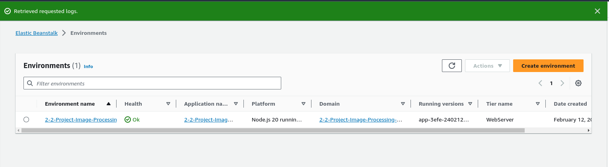

# 2-2-Project-Image-Processing-Mircoservice-AWS-
1. [Project Overview](#schema1)
2. [Getting Started](#schema2)
3. [Deploying your system](#schema3)
4. [REF](#schema4)

## 1. Project Overview

**Help Find Missing People**
You have been hired as a software engineer to develop an application that will help the FBI find missing people. The application will upload images to the FBI cloud database hosted in AWS. This will allow the FBI to run facial recognition software on the images to detect a match. You will be developing a NodeJS server and deploying it on AWS Elastic Beanstalk.

You will build upon the application we've developed during the lessons in this course. You'll complete a REST API endpoint in a backend service that processes incoming image URLs.

## 2. Getting Started
1. Set up node environment
You'll need to create a new node server. Open a new terminal within the project directory and run:

- Initialize a new project: `npm i`
- run the development server with `npm run start`

2. Create a new endpoint in the `server.js` file
Create a new an endpoint in `./src/server.js` which uses query parameter to download an image from a public URL, filter the image, and return the result.

## 3. Deploying your system

Used to `eb init` a new application and `eb create` a new environment to deploy your image-filter service! Don't forget you can use `eb deploy` to push changes.

- The url : http://2-2-project-image-processing-mircoservi.us-east-1.elasticbeanstalk.com/

## REF:

https://knowledge.udacity.com/questions/994301